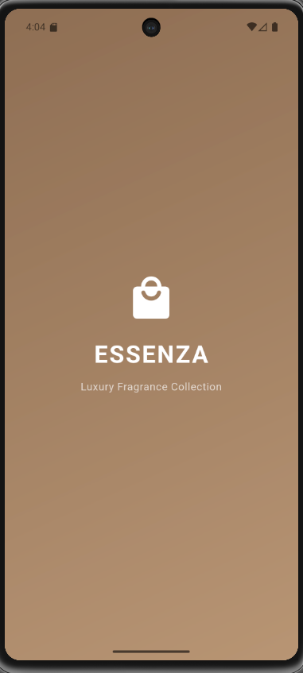
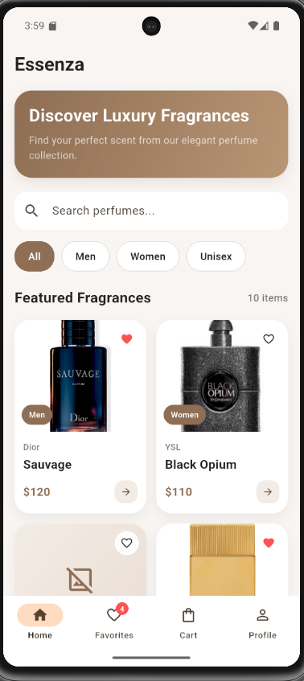
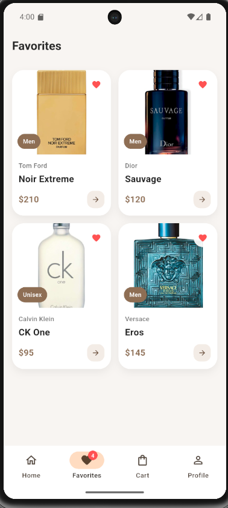
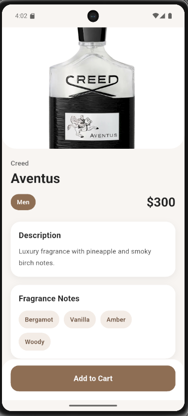
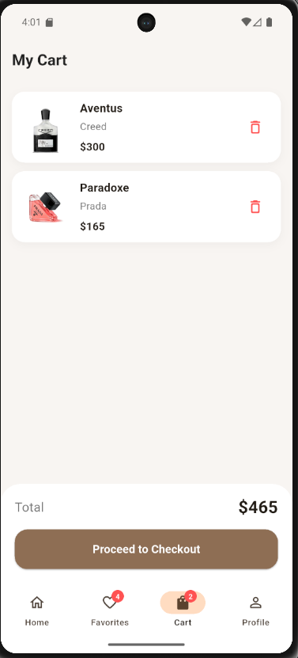

# Essenza

Essenza is a modern perfume catalog mobile application developed with Flutter.  
The application allows users to browse perfumes, search and filter products, view detailed perfume information, add items to favorites, add products to a shopping cart, and proceed to checkout.

This project was developed as part of a Flutter training program.

---

## Project Description

Essenza is designed as a perfume catalog application that demonstrates core Flutter concepts such as multi-screen navigation, UI design, state management, JSON data usage, and interactive features like favorites and cart systems.

Users can:
- Explore a list of perfumes
- Search for specific perfumes
- Filter perfumes by category
- View perfume details
- Add perfumes to favorites
- Add perfumes to a shopping cart
- Complete a checkout flow

---

## Features

- Splash Screen
- Bottom Navigation (Home, Favorites, Cart, Profile)
- Perfume listing from local JSON data
- Search functionality
- Category filtering
- Perfume detail screen
- Favorites system
- Cart system
- Checkout screen
- Hero animations between screens
- Badge indicators for Cart and Favorites

---

## Flutter Version

This project was developed with: Flutter 3.41.4

---

## Technologies Used

- Flutter
- Dart
- Material 3 UI
- Local JSON data source

---

## Screenshots

### Splash Screen

### Main Screen

### Favorites Screen

### Cart Details

### Checkout

